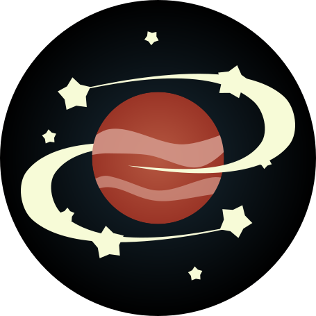

# Exosky! Hunting new horizons

"NASA Space Apps Challenge" 2024, submitted by the "Giovio Team"

 
<figcaption>App's logo</figcaption>

## Project

Our project is a desktop application concept that aims to bring the universe closer to the user.
The app is designed to have both an educational and entertaining purpose.

The idea is to create a platform where users can explore the universe, learn about celestial bodies, and perform data analysis on them.

We believe that the amount of data available is the main problem for a non expertise user to approach exoplanets and stars.
Our app will provide a user-friendly interface, with strong focus on visualization, thus reducing the effort required to retrive and understand the data.

### Explore our galaxy

We hope you will enjoy our app and have a wonderful exploration of the Earth's neighborhoods out there!

Giovio Team,

Tommaso, Andrea, Giuseppe & Sergio
